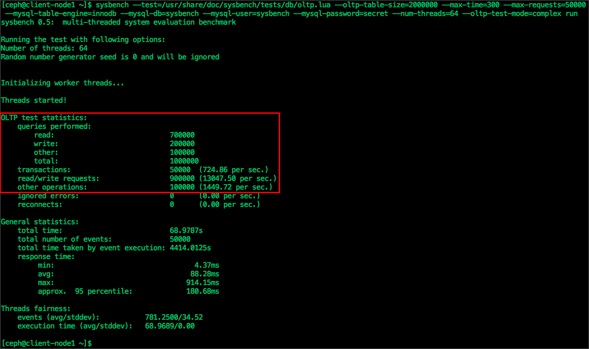

# Module 6 - MySQL Database on Ceph

In this module we will learn how to use Ceph Block Device as a persistent storage for MySQL database.

!!! note
    Before proceeding with this module make sure you have completed Module-2 and Module-3, which means you should have a running Ceph cluster and ``client-node1``  is configured to be Ceph client.

During the course of this module, we would be using ``client-node1`` machine and will be installing MySQL database together with persistent block storage from Ceph.

- From ``mgmt`` node , login to ``client-node1`` machine
```
$ ssh client-node1
```
- Verify Ceph cluster is accessible by rbd user
```
$ ceph -s --id rbd
```
- Create Ceph block device with name ``mariadb-disk1`` of size 10G
```
$ rbd create mariadb-disk1 --size 10240 --image-feature layering --id rbd
```
- Verify block device that we have just created
```
$ rbd ls --id rbd
$ rbd info mariadb-disk1 --id rbd
```
- Map ``mariadb-disk1`` block device on ``client-node1``
```
$ sudo rbd map mariadb-disk1 --id rbd
```
- Verify mapped block device
```
$ rbd showmapped --id rbd
```
From the above command output, make a note of mapped device name for  ``mariadb-disk1`` block device. In most of the cases it's  ``/dev/rbd1``. 

- On the mapped device, create xfs filesystem and mount it on ``/var/lib/mysql`` directory and verify
```
$ sudo mkfs.xfs /dev/rbd1
$ sudo mkdir /var/lib/mysql
$ sudo mount /dev/rbd1 /var/lib/mysql
$ sudo ls -l /var/lib/mysql ; sudo df -h /var/lib/mysql
```
Next , we will install MariaDB which is a community-developed fork of the MySQL relational database management system.

- Create MariaDB configuration file
```
$ sudo wget https://raw.githubusercontent.com/red-hat-storage/ceph-test-drive-bootstrap/master/mysql-module/my.cnf -O /etc/my.cnf
```
- Install MariaDB server
```
$ sudo yum install -y mariadb-server
```
- Start and MariaDB service
```
$ sudo systemctl start mariadb ; sudo systemctl enable mariadb
```
- Verify MariaDB **service must be running**
```
$ sudo systemctl status mariadb
```
- First interaction with running database
```
$ mysqladmin -u root version
$ mysql -u root -e 'SHOW DATABASES'
```
- You should see output similar as shown below
```
[ceph@client-node1 ~]$ mysqladmin -u root version
mysqladmin  Ver 9.0 Distrib 5.5.52-MariaDB, for Linux on x86_64
Copyright (c) 2000, 2016, Oracle, MariaDB Corporation Ab and others.

Server version		5.5.52-MariaDB
Protocol version	10
Connection		Localhost via UNIX socket
UNIX socket		/var/lib/mysql/mysql.sock
Uptime:			41 min 21 sec

Threads: 1  Questions: 1000769  Slow queries: 0  Opens: 65  Flush tables: 2  Open tables: 90  Queries per second avg: 403.373
[ceph@client-node1 ~]$
[ceph@client-node1 ~]$
[ceph@client-node1 ~]$ mysql -u root -e 'SHOW DATABASES'
+--------------------+
| Database           |
+--------------------+
| information_schema |
| mysql              |
| performance_schema |
| test               |
+--------------------+
[ceph@client-node1 ~]$

```
- Verify MySQL is using Ceph block storage
```
$ sudo ls -l /var/lib/mysql ; sudo df -h /var/lib/mysql
```
> **At this point we have a running MySQL database instance on top of Ceph Block Storage. Now let's do database reads/writes.**

- Install sysbench , a popular MySQL benchmarking tool
```
$ sudo yum install -y http://repo.percona.com/release/7/RPMS/x86_64/sysbench-0.5-6.el7.x86_64.rpm

```
- For sysbench, create a database , user and grant necessary access
```
$ mysql -u root -e "CREATE DATABASE sysbench;"
$ mysql -u root -e "CREATE USER 'sysbench'@'localhost' IDENTIFIED BY 'secret';"
$ mysql -u root -e "GRANT ALL PRIVILEGES ON *.* TO 'sysbench'@'localhost' IDENTIFIED  BY 'secret';"
```
- Using Sysbench , prepare testing database
```
$ sysbench --test=/usr/share/doc/sysbench/tests/db/oltp.lua --oltp-table-size=2000000 --max-time=300 --max-requests=5000 --mysql-table-engine=innodb --mysql-db=sysbench --mysql-user=sysbench --mysql-password=secret --num-threads=64 prepare
```
- Verify sysbench table rows created during prepare step
```
$ mysql -u root -e 'SELECT TABLE_NAME, TABLE_ROWS FROM information_schema.tables WHERE `table_schema` = "sysbench" ;'
```
- You should see similar output, as shown below


- Open a new SSH session to ``mgmt`` node and run `` watch ceph -s `` command to view real time read and write operations to Ceph cluster.
- From ``client-node1`` using Sysbench tool , perform read and write (mix) operation
```
$ sysbench --test=/usr/share/doc/sysbench/tests/db/oltp.lua --oltp-table-size=2000000 --max-time=300 --max-requests=50000 --mysql-table-engine=innodb --mysql-db=sysbench --mysql-user=sysbench --mysql-password=secret --num-threads=64 --oltp-test-mode=complex run
```
- You should see almost similar output, as shown below

> **This is it, we have reached to end of Module-6. In this module you have learned how MySQL database can be deployed on Ceph Block Storage **
